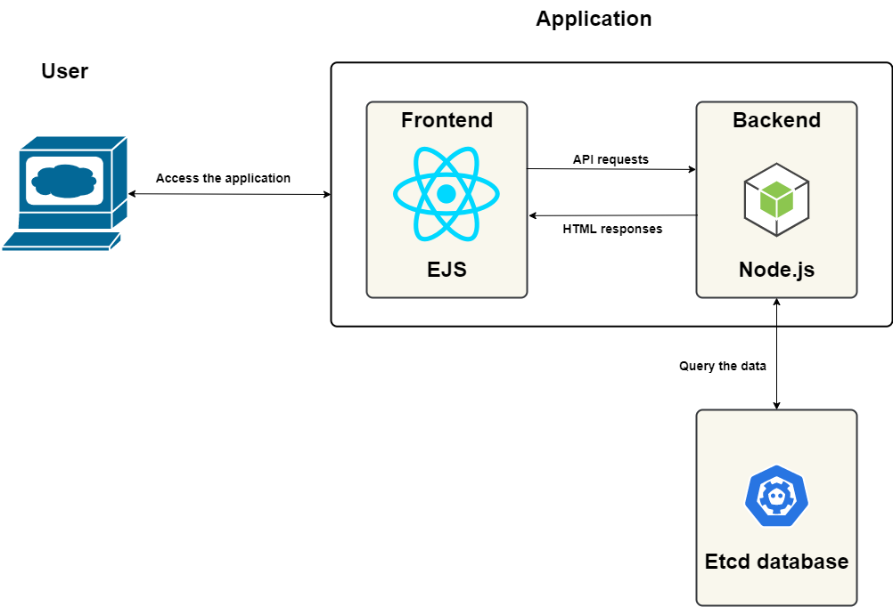

### Description

Shopping list application is an good starter to build a 2 tier microservice application and deploy it on any platforms like Kubernetes and OpenShift. The application consists of an **Etcd Database**  and **Node.js using Express** backend.

### Architecture

This application consists of an Etcd database and a Node.js backend and frontend. Combining these technologies, one can build a full-stack web application with CRUD operations. 

**Stack Components:**

1. **Etcd DB ([Etcd Operator](https://operatorhub.io/operator/postgresql))**

   Etcd is a strongly consistent, distributed key-value store that provides a reliable way to store data that needs to be accessed by a distributed system or cluster of machines. It gracefully handles leader elections during network partitions and can tolerate machine failure, even in the leader node.
   
   Applications of any complexity, from a simple web app to Kubernetes, can read data from and write data into etcd..  

   **Why use Etcd?**  

   - Simple interface - Read and write values using standard HTTP tools, such as curl.
   - Key-value storage - Store data in hierarchically organized directories, as in a standard filesystem
   - Watch for changes - Watch specific keys or directories for changes and react to changes in values
   - Optional SSL client certificate authentication
   - Benchmarked at 1000s of writes/s per instance

2. **Express (Back-End Framework)**

   It is a web application framework for Node.js. Being a free and open software, it is used for building web applications and specially APIs. Express provides a thin layer of fundamental web application features, without obscuring Node.js features that you already know.

   **Why use Express?**

   - Provides a robust set of features for both web and mobile applications
   - Makes back-end code easier and simpler to write.
   - Supports many middleware.
   - Minimal and Flexible web application framework.
   - Creating efficient and robust API is quick and easy.
   - Allows you to define an error handling middleware.

3. **Node.js (JavaScript runtime environment)**

   Node.js is a JavaScript runtime built on Chrome’s V8 JavaScript engine for developing server-side and networking applications. Being an asynchronous event-driven JavaScript runtime, it is used to build fast and scalable network applications. Node.js is free and open source server environment that runs on many platforms.

   **Why Node.js?**

   - Provides event-driven and asynchronous features which makes it lightweight and efficient.
   - No buffering and thus, is very fast.
   - Highly Scalable.
   - Highly extensible.
   - Provides advantage of caching.
   - Handles thousands of concurrent connections with a single server.
   - Provides vast number of libraries.

*Code sample provided and maintained by EDGE team.*